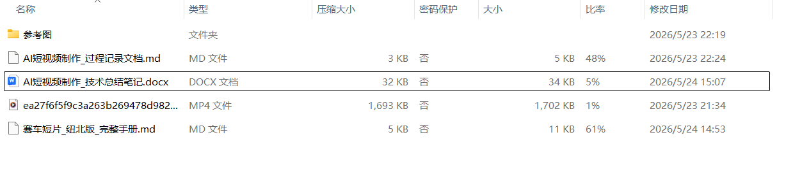
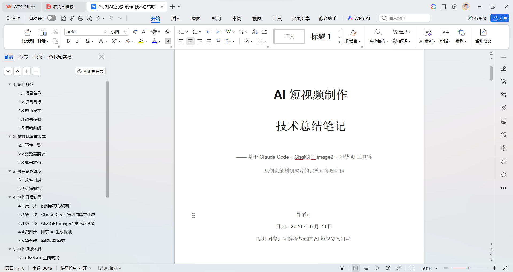
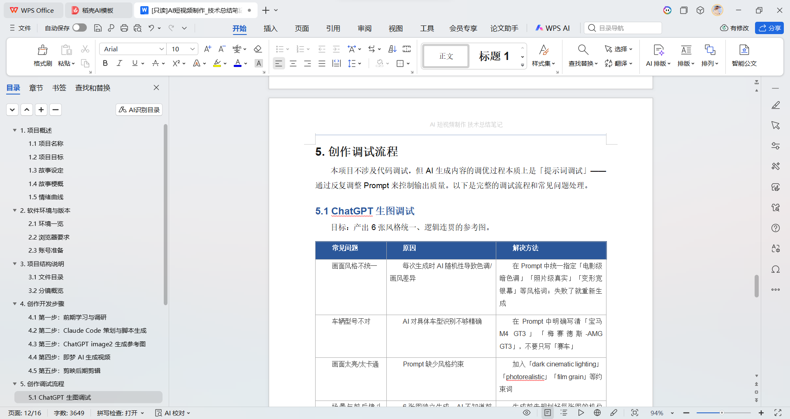

# research-summary — 科研项目技术总结笔记生成器

一个跨平台 AI Agent Skill（支持 **Claude Code** 和 **OpenAI Codex CLI**），**适用于所有专业**。帮助你在课题项目完成后，按导师要求产出**别人可以完整复现**的技术文档包。

不管你做的是机械实验、化学合成、土木设计、代码开发、数据分析还是田野调查，只要老师说过「把项目整理成文档」，这个 Skill 就能用。

## 解决的问题

做完了项目 ≠ 交付完成。导师和学生之间最大的痛点是：

- 项目做完了，文档没写
- 写了文档，但不完整——缺环境信息、缺踩坑记录、缺参考来源
- 文档和实际内容对不上，下一个同学没法接着做
- 想写但不知道从哪里开始，对着空白文档发呆

这个 Skill 不帮你「自动生成」——它会**主动向你提问**，像助教一样把你脑子里的东西一步步掏出来，整理成规范文档。最终交付 4 件套，验收标准就一条：**别人不看你的消息就能完整复现**。

## 前置条件

- **Claude Code**：安装 [Claude Code](https://claude.ai/code)（搜 B 站/抖音「Claude Code 安装教程」）
- **Codex CLI**：安装 [OpenAI Codex CLI](https://github.com/openai/codex)（搜「Codex CLI 安装教程」）

任选其一即可，Skill 在两个平台上功能一致。

## 安装本 Skill

### Claude Code

```bash
# Windows（PowerShell）
git clone https://github.com/whynotZYP/research-summary.git $env:USERPROFILE\.claude\skills\research-summary

# macOS / Linux
git clone https://github.com/whynotZYP/research-summary.git ~/.claude/skills/research-summary
```

### Codex CLI

```bash
# Windows（PowerShell）
git clone https://github.com/whynotZYP/research-summary.git $env:USERPROFILE\.agents\skills\research-summary

# macOS / Linux
git clone https://github.com/whynotZYP/research-summary.git ~/.agents/skills/research-summary
```

> 也可以克隆到项目的 `.claude/skills/` 或 `.agents/skills/` 目录下，仅在该项目中生效。

## 使用方式

在 Claude Code 或 Codex CLI 中直接对它说：

- 「写总结笔记」
- 「技术总结」
- 「项目复现笔记」
- 「整理项目文档」
- 「实验总结」
- 「毕设总结」
- 「课题总结」

也可以用命令方式显式调用：

- **Claude Code**：`/research-summary`
- **Codex CLI**：`$research-summary`

Skill 会启动，**主动向你提问**（不是让你填模板），一步步把你的项目信息掏出来，整理成规范文档。

## 交付物

每次完整产出包含 4 件东西：

| # | 交付物 | 说明 |
|---|--------|------|
| 1 | 技术总结笔记 | 项目环境及工具、操作步骤、调试流程、参考链接 |
| 2 | 过程记录文档 | 学习和操作中遇到的问题及解决方案，逐条记录 |
| 3 | 操作过程录屏 | 完整的运行/操作过程录像 |
| 4 | 项目文件压缩包 | 命名规范、关键处有注释说明、含可靠性测试记录 |

## 验收标准

**唯一标准**：一个刚接触该方向的同学，不跟你交流，只靠你给的文档和文件，就能完整复现你的项目。

## 适用场景（所有专业通用）

- 机械/土木/电气：课程设计、毕业设计文档整理
- 化学/生物/材料：实验报告、合成路径记录
- 计算机/软件/人工智能：代码项目、模型训练、仿真分析
- 经管/社科：数据分析、调研项目、模型构建
- 任何导师说过「把项目整理成文档」的场景

## 成果展示

以下是 Skill 实际产出的 Word 文档截图（以履带小车项目为例）：







## 作者

旺旺仙贝

## 许可

MIT License
